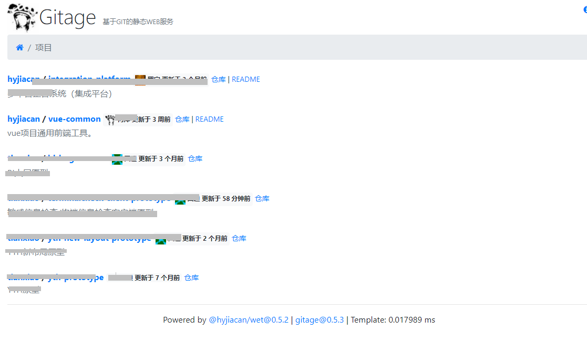

# gitage

Static web server based on git-scm.

Tested on [gitea](https://gitea.io/) for now.

Dependencies:

- Simple Javascript Template Engine [wet](http://github.com/hyjiacan/wet)

- Git, nodejs>8 must be installed on your server.

## Usage

```shell script
npm run build
node dist/gitage.js
```

## Server Configuration

Config file: `config` (case-sensitive), should be put in the root path of gitage.

*config*
```
# DEBUG flag
DEBUG = false
# ip to host
HOST = 0.0.0.0
# port to listen
PORT = 1997
# The path to put logs file, can be absolute or relative 
LOG_PATH = logs
# The path to checkout repository, can be absolute or relative
PROJECT_ROOT_PATH = projects
# Log the messages which higher than this level
LOG_LEVEL = info
# The temporary  path to the checkout, leave it blank to use the system temp path
PROJECT_CHECKOUT_TMP = 
```

> If no _config_ file, the value above will be the default values.

> Note: Configuration item name must be **UPPERCASE**

## Repo Configuration

Add file `gitage.config.json` into your repo, in the form bellow:

```json
{
  "type": "markdown",
  "path": "docs",
  "index": "index.html",
  "tag": true,
   "branch": "master",
   "ignore": [
     "file",
     "dir",
     "..."
   ]
}
```

- `type` Deploy type, only `markdown` supported currently, or just leave it blank **case-sensitive**
- `path` The directory to deploy (where the static assets located in), default: `docs`
- `index` The index file to deploy，default: `index.html/index.md` **case-sensitive**
- `tag` Whether to deploy only on `tag` pushed，default: `false` (planning)

Add web-hook on your repository:

POST `http://127.0.0.1:1997/hook/`


`127.0.0.1` The IP to serve
`1997` The port to serve

## Screenshots


